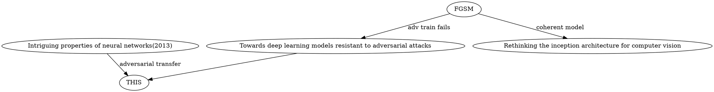

## First R.
+ P.S. 看上去就很厉害的样子。但是2014 FGSM不是指出了集成学习对于防御对抗攻击没有效果吗？？
+ 这是一篇基于之前对抗攻击与防御的研究上总结优化的一篇文章，开创性的推出了Ensemble Training的优化方法，对于防御攻击由一定的启示性意义。
+ 文章表述的较为清晰、同时阅读也具有一定的难度。可能受限于会议论文的篇幅，所以没有办法展得很开。但是有些内容在附录中有详细的提及。
+ 同时，这篇文章也反驳了2017年一篇文章中的观点。
+ 可以学习一下这篇论文反驳他人观点时的语调
+ 前置的工作

+ 标注样例：markdown：黄色底:关键的小结论与引用论断;红色底:不了解的要点。underline：蓝色：用于标注之后要关注的问题而做的记号。

## 反驳的语调学习
+ 他人的观点 "and thus concluded that the robustness of their model **should** extend to black-box adversaries."
+ 反驳"Surprisingly, we show that this is not the case"
+ "We demonstrated, formally and empirically, that..." "We **harness** this result in two ways"