## First R.
+ 实际多花了10分钟来读
+ 这篇文章应当是一部aa的开山之作，描述了一个研究的初步开展
+ 理论基础：神经网络和线性分类器、以及抗性最好的RBF
+ 表述较为清晰、合理性较好

```graphviz
digraph{
    "Linear perturbation";"Adversarial Training vs Weight decay";
    "Adversarial Training for deep network;Different model capacity";
    "How adversarial examples generalize";" The alternative hypotheses";
}
```

+ Intersection： et al.,2013

## Second R.
+ 其实每台明白文章的一些关键术语，在读第三遍之前可以花上10多分钟查阅一下其中之前标注过的点

##
+ 借助pytorch实现attack的产生已经完成并且效果不错
+ 如何实现adv training